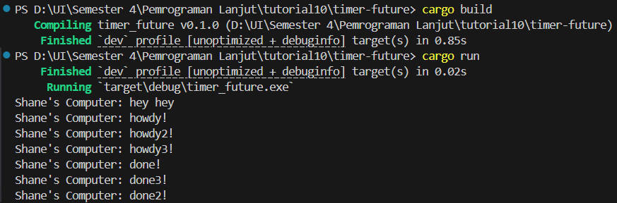
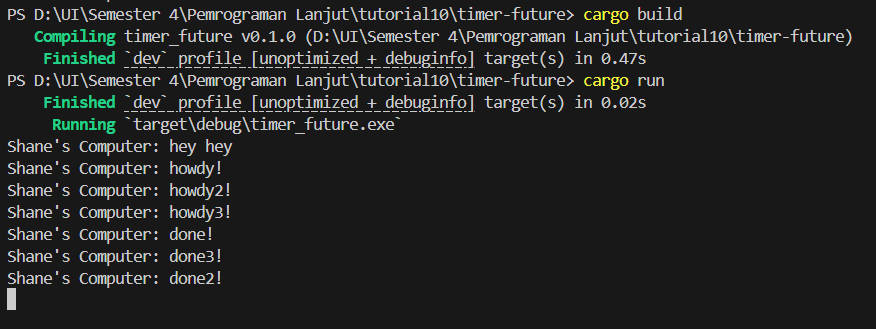

# Tutorial 10 Reflection
### Name: Shane Michael Tanata Tendy
### NPM: 2306259976
### Class: B

----

### Exercise 1.2

The output flow demonstrates the key concepts of async programming: spawning a task does not execute it immediately. Instead, it places the task 
in a queue to be executed when the executor polls it. The executor only polls the task when we explicitly call the `run` method.

The main thread continues to execute synchronously until it reaches the `run` method. At this point, the executor starts executing the task in the 
queue. 

So, for the main code, the output will be:
```
Shane's Computer: hey hey
Shane's Computer: howdy!
Shane's Computer: done!
```

This is because, the main thread executes the first statement, which is `println!("Shane's Computer: hey hey");` in line 108.
And then, it encounters the `executor.run();` in line 115, which will execute the task in the queue (in the spawn).
Finally, it will print the last two statements in the task, which are `println!("Shane's Computer: howdy!");` and `println!("Shane's Computer: done!");` in lines 111 and 113 respectively. 

Result image:


### Exercise 1.3
When we put multiple spawner in the code, the spawner will print the statement asynchronously. So, the three spawners will print the first statement
in a random order. And then the three of them will wait for 2 seconds before printing the second statement in a random order. That's why we can see
that the first statement is printed in a random order (even though in this case it is printed in order tho), and the second statement is printed 
in a random order too. However, the same as before, the main thread will print the 'hey hey' statement first before the spawners, since it still 
follows the same synchronous order as before.

For the second case, the code hangs and doesn't terminate after printing all the statements. This is because The `Executor::run` method contains a 
loop that continues as long as it can receive tasks from the channel:
```rust
fn run(&self) {
    while let Ok(task) = self.ready_queue.recv() {
        ...
    }
}
```
This `recv()` method will block and wait for a new task to arrive if the channel is empty. It will only return an error (and thus end the loop) 
if the sending end of the channel is closed. When we don't drop the spawner, the sending end of the channel remains open, and the loop will continue
to wait for new tasks indefinitely. This is why the program hangs and doesn't terminate. This demonstrates an important concept in async runtime design: 
the executor needs a way to know when no more tasks will be coming. In this simple example, dropping the spawner serves that purpose by closing the channel.

Result image:

When I don't drop the spawner:



When I drop the spawner:

