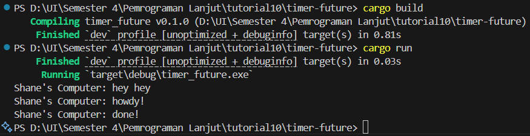

# Tutorial 10 Reflection
### Name: Shane Michael Tanata Tendy
### NPM: 2306259976
### Class: B

----

The output flow demonstrates the key concepts of async programming: spawning a task does not execute it immediately. Instead, it places the task 
in a queue to be executed when the executor polls it. The executor only polls the task when we explicitly call the `run` method.

The main thread continues to execute synchronously until it reaches the `run` method. At this point, the executor starts executing the task in the 
queue. 

So, for the main code, the output will be:
```
Shane's Computer: hey hey
Shane's Computer: howdy!
Shane's Computer: done!
```

This is because, the main thread executes the first statement, which is `println!("Shane's Computer: hey hey");` in line 108.
And then, it encounters the `executor.run();` in line 115, which will execute the task in the queue (in the spawn).
Finally, it will print the last two statements in the task, which are `println!("Shane's Computer: howdy!");` and `println!("Shane's Computer: done!");` in lines 111 and 113 respectively. 

Result image:

